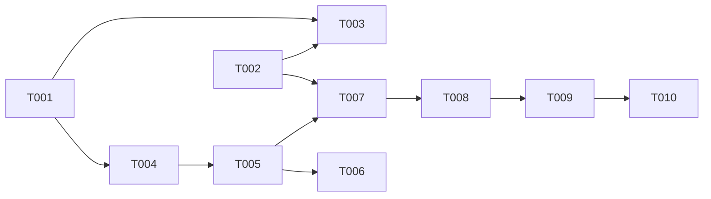

# Plan: Fix GraphQL Schema Error in getThreadIdFromComment

## Overview
- **Source**: GitHub Issue #251
- **Issue**: #251
- **Created**: 2026-02-02
- **Approach**: PR reviewThreads 조회 후 Comment ID 매칭 + Thread ID 직접 입력 지원

## Problem Summary

`gh please pr review reply` 명령이 GraphQL 스키마 오류로 실패:
```
❌ Error: GraphQL query failed: gh: Field 'pullRequestReviewThread' doesn't exist on type 'PullRequestReviewComment'
```

**근본 원인**: `getThreadIdFromComment()` 함수가 존재하지 않는 `PullRequestReviewComment.pullRequestReviewThread` 필드를 사용

## Architecture Decision

### 선택한 접근 방식: 하이브리드 (Comment ID 매칭 + Thread ID 직접 지원)

GitHub GraphQL API 조사 결과, `PullRequestReviewComment`에서 Thread를 직접 가져올 수 있는 필드가 없음.
GitHub 공식 커뮤니티에서도 `reviewThreads` connection 사용을 권장.

**구현 전략**:
1. **기존 방식 유지 (Comment ID)**: PR의 `reviewThreads` 조회 후 comment 매칭
2. **새로운 방식 추가 (Thread ID 직접)**: Thread ID (PRRT_...) 직접 입력 시 바로 사용

### ID 형식별 처리

| 입력 형식 | 예시 | 처리 방식 |
|-----------|------|-----------|
| Database ID (숫자) | `2442802556` | reviewThreads 조회 → comment 매칭 |
| Comment Node ID | `PRRC_kwDOP34z...` | reviewThreads 조회 → comment 매칭 |
| **Thread Node ID** | `PRRT_kwDOABC...` | **직접 사용 (API 호출 없음)** |

### 대안 비교

| 접근 방식 | 선택 | 이유 |
|-----------|------|------|
| PR reviewThreads 매칭 | ✅ 선택 | GitHub 권장, 기존 UX 유지 |
| Thread ID 직접 입력 | ✅ 추가 | 효율적 (API 호출 생략), 고급 사용자용 |
| REST API fallback | ❌ | Thread ID 획득 불가 |

### References
- [GitHub Community Discussion #24666](https://github.com/orgs/community/discussions/24666)
- [GitHub Community Discussion #24850](https://github.com/orgs/community/discussions/24850)

## Tasks

### Phase 1: ID Detection & Utility
- [ ] T001 [P] `id-converter.ts`에 Thread ID 감지 함수 추가 - `isThreadNodeId()` (file: src/lib/id-converter.ts)
- [ ] T002 [P] `id-converter.ts`에 통합 ID 변환 함수 추가 - `resolveThreadId()` (file: src/lib/id-converter.ts)
- [ ] T003 Unit test 작성 - ID 감지 및 변환 함수 (depends on T001, T002, file: test/lib/id-converter.test.ts)

### Phase 2: Core Fix
- [ ] T004 `getThreadIdFromComment()` 함수 시그니처 변경 - prNodeId 파라미터 추가 (depends on T001, file: src/lib/github/review-operations.ts)
- [ ] T005 `getThreadIdFromComment()` 구현 변경 - reviewThreads 조회 후 comment 매칭 (depends on T004, file: src/lib/github/review-operations.ts)
- [ ] T006 Unit test 작성 - `getThreadIdFromComment()` 함수 (depends on T005, file: test/lib/github/review-operations.test.ts)

### Phase 3: Caller Updates
- [ ] T007 `createReviewCommentReply()` 수정 - Thread ID 직접 사용 또는 comment에서 조회 (depends on T002, T005, file: src/lib/github/review-operations.ts)
- [ ] T008 `createReviewReplyCommand()` 수정 - Thread ID 직접 입력 지원 (depends on T007, file: src/commands/pr/review/reply.ts)

### Phase 4: Testing & Validation
- [ ] T009 Integration test 추가 - reply 명령 E2E 시나리오 (depends on T008, file: test/commands/pr/review/reply.test.ts)
- [ ] T010 Manual test - 실제 PR에서 reply 명령 테스트 (depends on T009)

## Dependencies



**Parallel Group 1**: T001, T002 (독립적 - ID 유틸리티)
**Parallel Group 2**: T003, T004 (T001/T002 완료 후)
**Sequential Core**: T005 → T006
**Sequential Caller**: T007 → T008 → T009 → T010

## Key Files

| File | Action | Purpose |
|------|--------|---------|
| `src/lib/id-converter.ts` | Modify | Thread ID 감지/변환 유틸리티 추가 |
| `src/lib/github/review-operations.ts` | Modify | 핵심 함수 수정 |
| `src/commands/pr/review/reply.ts` | Modify | 명령어 호출부 수정, Thread ID 직접 입력 지원 |
| `test/lib/id-converter.test.ts` | Modify | ID 변환 유틸리티 테스트 |
| `test/lib/github/review-operations.test.ts` | Create/Modify | Unit tests |
| `test/commands/pr/review/reply.test.ts` | Create/Modify | Integration tests |

## Implementation Details

### T001: Thread ID 감지 함수 추가 (`id-converter.ts`)

```typescript
/**
 * Thread Node ID 형식 감지 (PRRT_...)
 */
export function isThreadNodeId(identifier: string): boolean {
  return /^PRRT_[\w-]+$/.test(identifier)
}
```

### T002: 통합 ID 변환 함수 추가 (`id-converter.ts`)

```typescript
/**
 * 입력 ID를 Thread ID로 변환
 * - Thread ID (PRRT_...): 그대로 반환 (API 호출 없음)
 * - Comment Node ID (PRRC_...): reviewThreads 조회 후 매칭
 * - Database ID (숫자): Node ID 변환 후 reviewThreads 조회
 */
export async function resolveThreadId(
  identifier: string,
  prNodeId: string,
): Promise<string> {
  // Thread ID면 바로 반환
  if (isThreadNodeId(identifier)) {
    return identifier
  }

  // Comment ID면 thread 찾기
  return getThreadIdFromComment(identifier, prNodeId)
}
```

### T004-T005: `getThreadIdFromComment()` 변경

**Before (현재 - 오류 발생)**:
```typescript
export async function getThreadIdFromComment(
  commentNodeId: string,
): Promise<string> {
  const query = `
    query GetThreadFromComment($commentId: ID!) {
      node(id: $commentId) {
        ... on PullRequestReviewComment {
          pullRequestReviewThread {  // ❌ 존재하지 않는 필드
            id
          }
        }
      }
    }
  `
  // ...
}
```

**After (수정)**:
```typescript
export async function getThreadIdFromComment(
  commentNodeId: string,
  prNodeId: string,  // 새 파라미터
): Promise<string> {
  // 1. PR의 모든 reviewThreads 조회 (최대 100개)
  const query = `
    query GetThreadsForComment($prId: ID!) {
      node(id: $prId) {
        ... on PullRequest {
          reviewThreads(first: 100) {
            nodes {
              id
              comments(first: 100) {
                nodes {
                  id
                  databaseId
                }
              }
            }
          }
        }
      }
    }
  `

  const data = await executeGraphQL(query, { prId: prNodeId })

  // 2. Comment Node ID 또는 Database ID로 thread 찾기
  for (const thread of data.node.reviewThreads.nodes) {
    for (const comment of thread.comments.nodes) {
      if (comment.id === commentNodeId ||
          comment.databaseId?.toString() === commentNodeId) {
        return thread.id
      }
    }
  }

  throw new Error(`Thread not found for comment ${commentNodeId}`)
}
```

### T007: `createReviewCommentReply()` 수정

```typescript
import { isThreadNodeId, resolveThreadId } from '../id-converter'

export async function createReviewCommentReply(
  identifier: string,  // Comment ID 또는 Thread ID
  body: string,
  prNodeId: string,
): Promise<{ nodeId: string; databaseId: number; url: string }> {
  // Thread ID면 바로 사용, 아니면 comment에서 조회
  const threadId = await resolveThreadId(identifier, prNodeId)

  const mutation = `
    mutation CreateReviewCommentReply($threadId: ID!, $body: String!) {
      addPullRequestReviewThreadReply(input: {
        pullRequestReviewThreadId: $threadId
        body: $body
      }) {
        comment {
          id
          databaseId
          url
        }
      }
    }
  `
  // ... 나머지 동일
}
```

### T008: `createReviewReplyCommand()` 수정

```typescript
// reply.ts - 명령어 설명 및 argument 업데이트
command
  .description('Create a reply to a PR review thread')
  .argument('<id>', 'Thread ID (PRRT_...), Comment ID (PRRC_...), or Database ID (number)')
  .option('-b, --body <text>', 'Reply body text')
  // ...

// action handler 내부
const prNodeId = await getPrNodeId(prInfo.owner, prInfo.repo, prInfo.number)
const result = await createReviewCommentReply(identifier, body, prNodeId)
```

## Verification

### Automated Tests
- [ ] Unit tests: `getThreadIdFromComment()` 함수 - comment 매칭 로직
- [ ] Integration tests: `gh please pr review reply` 명령 E2E
- [ ] 기존 테스트 통과 확인

### Manual Testing
- [ ] 실제 PR에서 Database ID로 reply 생성
- [ ] 실제 PR에서 Comment Node ID (PRRC_...)로 reply 생성
- [ ] **실제 PR에서 Thread Node ID (PRRT_...)로 reply 생성** (NEW)
- [ ] thread가 100개 초과인 PR에서 테스트 (optional - 페이지네이션 미구현 확인)

### Acceptance Criteria Check
- [ ] `gh please pr review reply <id>` 명령이 정상 작동
- [ ] Comment ID (PRRC_...) 입력 지원
- [ ] Database ID (숫자) 입력 지원
- [ ] **Thread ID (PRRT_...) 직접 입력 지원** (NEW)
- [ ] Thread ID 사용 시 API 호출 최소화 확인
- [ ] 에러 메시지가 명확하고 도움이 됨

## Risks & Mitigations

| Risk | Impact | Mitigation |
|------|--------|------------|
| PR당 100개 thread 제한 | 낮음 | 대부분 PR은 100개 미만, 향후 pagination 추가 가능 |
| 추가 API 호출로 인한 지연 | 낮음 | 단일 쿼리로 모든 threads/comments 조회 |
| 기존 테스트 깨짐 | 중간 | 시그니처 변경 시 모든 호출부 업데이트 |

## Notes

- `listReviewThreads()` 함수가 이미 유사한 GraphQL 쿼리를 사용하므로 패턴 재사용 가능
- i18n 에러 메시지 업데이트 필요할 수 있음 (thread not found 시)
- 향후 pagination이 필요하면 cursor 기반 pagination 추가 고려
- **Thread ID 직접 입력 시 API 호출 없이 바로 mutation 실행 가능** - 성능 이점

## CLI Usage Examples

```bash
# 기존 방식 (Comment ID) - 여전히 작동
gh please pr review reply 2442802556 -b "Fixed!"                  # Database ID
gh please pr review reply PRRC_kwDOP34zbs6ShH0J -b "Fixed!"       # Comment Node ID

# 새로운 방식 (Thread ID) - 직접 입력
gh please pr review thread list 123                               # Thread ID 조회
gh please pr review reply PRRT_kwDOABC123xyz -b "Fixed!"          # Thread Node ID 직접 사용
```

## Review Status
- **Reviewed**: 2026-02-02
- **Result**: APPROVED
- **User Approved**: Yes
- **Issue Comment**: https://github.com/pleaseai/gh-please/issues/251#issuecomment-3832751980
- **Command Structure Decision**: `review reply` 유지 (기존 호환성, 간결함)
- **Reviewer Notes**: Plan is technically sound and addresses the core problem correctly
