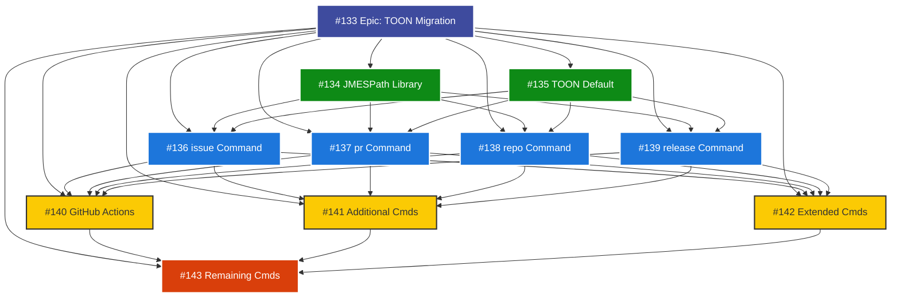

# TOON Migration Dependency Graph

Visual representation of the TOON + JMESPath migration project structure and dependencies.

## Epic Overview

**Epic #133**: TOON + JMESPath Migration for All gh CLI Commands

## Issue Structure

```
#133 Epic: TOON + JMESPath Migration
├── Phase 1: Core Commands (4-6 weeks)
│   ├── #134 Phase 1.0: JMESPath Library Integration (1 week)
│   ├── #135 Phase 1.1: Update gh-passthrough for TOON Default (1 week)
│   ├── #136 Phase 1.2: issue Command TOON Migration (1.5 weeks)
│   ├── #137 Phase 1.3: pr Command TOON Migration (2 weeks)
│   ├── #138 Phase 1.4: repo Command TOON Migration (1.5 weeks)
│   └── #139 Phase 1.5: release Command TOON Migration (1 week)
│
├── Phase 2: GitHub Actions + Additional (3-4 weeks)
│   ├── #140 Phase 2.1: GitHub Actions Commands (workflow, run, cache) (2 weeks)
│   ├── #141 Phase 2.2: Additional Commands (api, search, label, secret, variable) (1.5 weeks)
│   └── #142 Phase 2.3: Extended Commands (gist, org, project, codespace) (1.5 weeks)
│
└── Phase 3: Remaining Commands (2-3 weeks)
    └── #143 Phase 3: Remaining Commands TOON Migration (2 weeks)
```

## Dependency Graph



## Dependency Matrix

| Issue | Blocked By | Blocks | Estimated Time |
|-------|------------|--------|----------------|
| #134 Phase 1.0 | None | #136, #137, #138, #139 | 1 week |
| #135 Phase 1.1 | None | #136, #137, #138, #139 | 1 week |
| #136 Phase 1.2 | #134, #135 | #140, #141, #142 | 1.5 weeks |
| #137 Phase 1.3 | #134, #135 | #140, #141, #142 | 2 weeks |
| #138 Phase 1.4 | #134, #135 | #140, #141, #142 | 1.5 weeks |
| #139 Phase 1.5 | #134, #135 | #140, #141, #142 | 1 week |
| #140 Phase 2.1 | #136, #137, #138, #139 | #143 | 2 weeks |
| #141 Phase 2.2 | #136, #137, #138, #139 | #143 | 1.5 weeks |
| #142 Phase 2.3 | #136, #137, #138, #139 | #143 | 1.5 weeks |
| #143 Phase 3 | #140, #141, #142 | None | 2 weeks |

## Critical Path

The critical path for this project:

```
#134 (1w) → #135 (1w) → #137 (2w) → #140 (2w) → #143 (2w) = 8 weeks minimum
```

However, with parallel work:

```
Week 1-2:  #134 + #135 (parallel, foundation)
Week 3-4:  #136, #137, #138, #139 (parallel, Phase 1 commands)
Week 5-6:  Continue #137 (pr commands, 2 weeks total)
Week 7-8:  #140, #141, #142 (parallel, Phase 2)
Week 9-10: Continue #140 (GitHub Actions, 2 weeks total)
Week 11-13: #143 (Phase 3, 2 weeks)
```

**Total: 13 weeks (3 months)**

## Parallel Work Opportunities

### Weeks 1-2 (Foundation)
Can run in parallel:
- #134 JMESPath Library Integration
- #135 TOON Default Output

### Weeks 3-6 (Phase 1 Core Commands)
Can run in parallel after #134 and #135 complete:
- #136 issue Command (1.5 weeks)
- #137 pr Command (2 weeks) ← Longest
- #138 repo Command (1.5 weeks)
- #139 release Command (1 week)

**Strategy**: Start all four simultaneously, expect completion by week 6.

### Weeks 7-10 (Phase 2)
Can run in parallel after Phase 1 completes:
- #140 GitHub Actions (2 weeks) ← Longest
- #141 Additional Commands (1.5 weeks)
- #142 Extended Commands (1.5 weeks)

**Strategy**: Start all three simultaneously, expect completion by week 10.

### Weeks 11-13 (Phase 3)
Sequential work after Phase 2:
- #143 Remaining Commands (2 weeks)

## Risk Mitigation

### High-Risk Dependencies

1. **#134 JMESPath Library** - Blocks 4 issues
   - **Risk**: Library integration issues
   - **Mitigation**: Start immediately, allocate experienced developer

2. **#135 TOON Default** - Blocks 4 issues
   - **Risk**: Breaking changes for users
   - **Mitigation**: Thorough testing, clear migration guide

3. **#137 pr Command** - Longest Phase 1 task (2 weeks)
   - **Risk**: Delays Phase 2 start
   - **Mitigation**: Allocate senior developer, monitor progress closely

4. **#140 GitHub Actions** - Longest Phase 2 task (2 weeks)
   - **Risk**: Delays Phase 3 start
   - **Mitigation**: Early start, parallel testing

## Progress Tracking

Track completion using GitHub Projects or this checklist:

### Phase 1: Core Commands ✅ 0/6
- [ ] #134 JMESPath Library Integration
- [ ] #135 TOON Default Output
- [ ] #136 issue Command
- [ ] #137 pr Command
- [ ] #138 repo Command
- [ ] #139 release Command

### Phase 2: GitHub Actions + Additional ✅ 0/3
- [ ] #140 GitHub Actions Commands
- [ ] #141 Additional Commands
- [ ] #142 Extended Commands

### Phase 3: Remaining ✅ 0/1
- [ ] #143 Remaining Commands

## Related Documentation

- [TOON_JMESPATH_MIGRATION.md](./TOON_JMESPATH_MIGRATION.md) - Migration plan
- [TOON_COMMAND_REFERENCE.md](./TOON_COMMAND_REFERENCE.md) - Command reference
- [JMESPATH_PATTERNS.md](./JMESPATH_PATTERNS.md) - Query patterns

## Quick Links

- [Epic #133](https://github.com/pleaseai/gh-please/issues/133)
- [Phase 1.0 #134](https://github.com/pleaseai/gh-please/issues/134)
- [Phase 1.1 #135](https://github.com/pleaseai/gh-please/issues/135)
- [Phase 1.2 #136](https://github.com/pleaseai/gh-please/issues/136)
- [Phase 1.3 #137](https://github.com/pleaseai/gh-please/issues/137)
- [Phase 1.4 #138](https://github.com/pleaseai/gh-please/issues/138)
- [Phase 1.5 #139](https://github.com/pleaseai/gh-please/issues/139)
- [Phase 2.1 #140](https://github.com/pleaseai/gh-please/issues/140)
- [Phase 2.2 #141](https://github.com/pleaseai/gh-please/issues/141)
- [Phase 2.3 #142](https://github.com/pleaseai/gh-please/issues/142)
- [Phase 3 #143](https://github.com/pleaseai/gh-please/issues/143)
