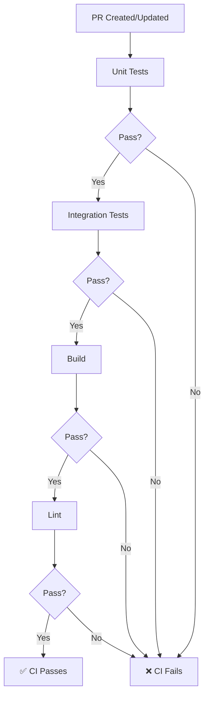
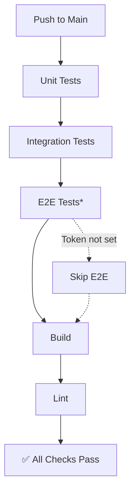

# CI/CD Configuration

This document describes the GitHub Actions workflows for automated testing and deployment.

## Workflows Overview

```
.github/workflows/
├── ci.yml              # Main CI pipeline (on push/PR)
├── manual-e2e.yml      # Manual E2E test trigger
├── release-please.yml  # Automated releases
└── release.yml         # Release publishing
```

## Main CI Pipeline (`ci.yml`)

Runs on every push to `main` and on all pull requests.

### Jobs

#### 1. Unit Tests
**Purpose**: Fast feedback on code changes
**Runs on**: Every push and PR
**Duration**: ~30-60 seconds

```
Steps:
1. Checkout code
2. Setup Bun
3. Install dependencies
4. Type check (tsc)
5. Run unit tests
6. Generate coverage
7. Upload to Codecov
```

**What's tested:**
- All library functions (`test/lib/`)
- Command implementations (`test/commands/`)
- Type definitions and schemas
- ~87 test cases

#### 2. Integration Tests
**Purpose**: Verify CLI command execution
**Runs on**: After unit tests pass
**Duration**: ~1-2 minutes

```
Steps:
1. Checkout code
2. Setup Bun
3. Install dependencies
4. Run integration tests
5. Upload test results as artifacts
```

**What's tested:**
- Complete CLI execution (`test/integration/cli/`)
- Command output formatting
- Error handling
- Help text and documentation

#### 3. E2E Tests (Optional)
**Purpose**: Validate against real GitHub API
**Runs on**: Only on `main` branch or manual trigger
**Duration**: ~2-5 minutes

```
Conditions:
- Only runs on main branch push
- Or when manually triggered via workflow_dispatch
- Requires GITHUB_TEST_TOKEN secret

Steps:
1. Checkout code
2. Setup Bun and GitHub CLI
3. Install dependencies
4. Run E2E tests (if token available)
5. Upload test results
```

**What's tested:**
- Real GitHub API interactions
- Sub-issue management workflows
- Dependency management workflows
- Actual issue creation and manipulation

#### 4. Build
**Purpose**: Verify project builds successfully
**Runs on**: Every push and PR
**Duration**: ~30 seconds

```
Steps:
1. Checkout code
2. Setup Bun
3. Install dependencies
4. Build project
5. Verify dist/index.js exists
```

#### 5. Lint
**Purpose**: Code quality and style checks
**Runs on**: Every push and PR
**Duration**: ~30 seconds

```
Steps:
1. Checkout code
2. Setup Bun
3. Install dependencies
4. Run ESLint
```

## Manual E2E Workflow (`manual-e2e.yml`)

Allows developers to trigger E2E tests manually with custom parameters.

### How to Run

1. Go to GitHub Actions tab
2. Select "Manual E2E Tests" workflow
3. Click "Run workflow"
4. Configure parameters:
   - **test_owner**: Repository owner (default: `gh-please-e2e`)
   - **test_repo**: Repository name (default: `test-repo`)
   - **skip_cleanup**: Keep test issues for debugging (default: `false`)
5. Click "Run workflow"

### Parameters

| Parameter | Description | Default | Required |
|-----------|-------------|---------|----------|
| `test_owner` | GitHub username/org for test repo | `gh-please-e2e` | No |
| `test_repo` | Test repository name | `test-repo` | No |
| `skip_cleanup` | Skip cleanup (for debugging) | `false` | No |

### Example Use Cases

**Debug failed E2E test:**
```
test_owner: my-org
test_repo: my-test-repo
skip_cleanup: true  ← Keep test issues to inspect them
```

**Test against different repository:**
```
test_owner: different-org
test_repo: another-repo
skip_cleanup: false
```

## Required Secrets

Configure these in repository settings → Secrets and variables → Actions:

### Secrets

| Name | Description | Required For | How to Get |
|------|-------------|--------------|------------|
| `CODECOV_TOKEN` | Codecov upload token | Coverage reports | [codecov.io](https://codecov.io) |
| `GITHUB_TEST_TOKEN` | GitHub PAT for E2E tests | E2E tests | Settings → Developer settings → Personal access tokens |

**Note**: E2E tests will be skipped if `GITHUB_TEST_TOKEN` is not set (not a failure).

### Variables (Optional)

| Name | Description | Default |
|------|-------------|---------|
| `GITHUB_TEST_OWNER` | Default test repo owner | `gh-please-e2e` |
| `GITHUB_TEST_REPO` | Default test repo name | `test-repo` |

## Creating GitHub Test Token

For E2E tests, you need a GitHub personal access token with the following permissions:

1. Go to GitHub → Settings → Developer settings → Personal access tokens → Tokens (classic)
2. Click "Generate new token (classic)"
3. Give it a descriptive name: `gh-please-e2e-tests`
4. Select scopes:
   - ✅ `repo` (Full control of private repositories)
   - ✅ `workflow` (Update GitHub Action workflows)
5. Set expiration (recommend 90 days, then rotate)
6. Click "Generate token"
7. Copy the token immediately
8. Add to repository secrets as `GITHUB_TEST_TOKEN`

**⚠️ Security Notes:**
- Use a dedicated test token, not your personal token
- Consider using a bot account for CI
- Rotate tokens regularly
- Use minimal required permissions

## Test Execution Flow

### On Pull Request



### On Main Branch Push



## Coverage Reporting

Coverage reports are generated during unit tests and uploaded to Codecov.

### Codecov Badge

Add to README:

```markdown
[](https://codecov.io/gh/pleaseai/github)
```

### Coverage Thresholds

| Component | Target | Current |
|-----------|--------|---------|
| Overall | 80% | Check Codecov |
| Unit Tests | 90% | ~87 tests |
| Integration | 80% | Comprehensive |
| E2E | Critical paths | Sub-issue, Dependency |

## Artifacts

Test results are uploaded as artifacts for debugging:

| Artifact | Content | Retention |
|----------|---------|-----------|
| `integration-test-results` | Integration test logs, coverage | 7 days |
| `e2e-test-results` | E2E test logs | 7 days (manual: 14 days) |

### Downloading Artifacts

1. Go to Actions tab
2. Click on workflow run
3. Scroll to "Artifacts" section
4. Download desired artifact

## Troubleshooting

### Unit Tests Fail

1. Check test output in workflow logs
2. Run locally: `bun run test:unit`
3. Check for type errors: `bun run type-check`

### Integration Tests Fail

1. Download integration test artifacts
2. Run locally: `bun run test:integration`
3. Check if mock setup is correct

### E2E Tests Fail

1. Verify `GITHUB_TEST_TOKEN` is set
2. Check token permissions (needs `repo` scope)
3. Verify test repository exists and is accessible
4. Run manually with cleanup skipped:
   ```bash
   gh workflow run manual-e2e.yml \
     -f skip_cleanup=true \
     -f test_owner=your-org \
     -f test_repo=your-repo
   ```
5. Check created issues on GitHub for debugging

### Build Fails

1. Run locally: `bun run build`
2. Check for TypeScript errors
3. Verify all dependencies are in package.json

### Coverage Upload Fails

This is non-critical (marked `continue-on-error`):
1. Check if `CODECOV_TOKEN` is set
2. Verify token is valid
3. Check Codecov service status

## Best Practices

### For Contributors

1. **Run tests locally before pushing:**
   ```bash
   bun run test:all  # Unit + Integration
   bun run lint
   bun run type-check
   ```

2. **Check CI status on PR:**
   - Wait for all checks to pass
   - Review coverage changes
   - Fix any failures before requesting review

3. **Add tests for new features:**
   - Unit tests for new functions
   - Integration tests for new commands
   - Consider E2E tests for critical workflows

### For Maintainers

1. **Enable E2E tests:**
   ```bash
   # Add GITHUB_TEST_TOKEN to repository secrets
   # Create dedicated test repository
   # Configure GITHUB_TEST_OWNER and GITHUB_TEST_REPO variables
   ```

2. **Monitor test coverage:**
   - Review Codecov reports
   - Ensure coverage doesn't decrease
   - Target 80%+ overall coverage

3. **Rotate test tokens:**
   - Set token expiration
   - Rotate every 90 days
   - Use bot account for automation

4. **Review artifacts periodically:**
   - Check for persistent test failures
   - Clean up old workflow runs

## Local Development

Match CI environment locally:

```bash
# Install dependencies
bun install

# Run all checks (same as CI)
bun run type-check
bun run lint
bun run test:unit
bun run test:integration
bun run build

# Or use the combined command
bun run test:all && bun run build
```

## Future Improvements

- [ ] Add performance benchmarking
- [ ] Implement test result caching
- [ ] Add mutation testing
- [ ] Create nightly E2E test runs
- [ ] Add test flakiness detection
- [ ] Implement parallel test execution
- [ ] Add visual regression tests (if UI added)

## Resources

- [GitHub Actions Documentation](https://docs.github.com/en/actions)
- [Bun Test Runner](https://bun.sh/docs/cli/test)
- [Codecov Documentation](https://docs.codecov.com/)
- [Testing Overview](testing/testing-overview.md)
